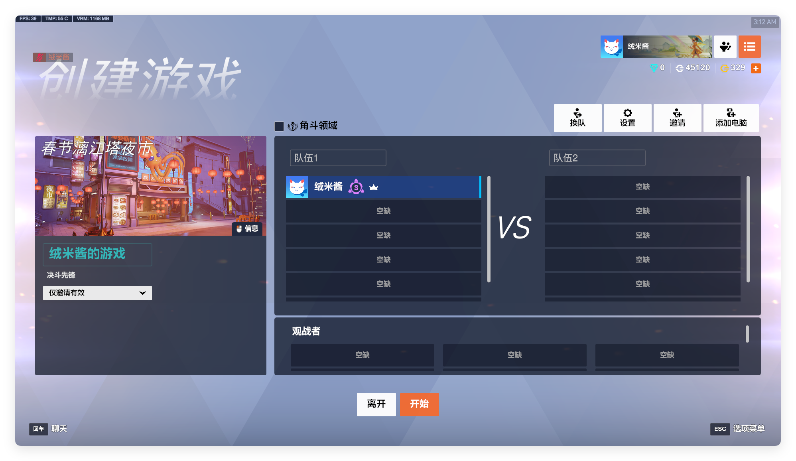
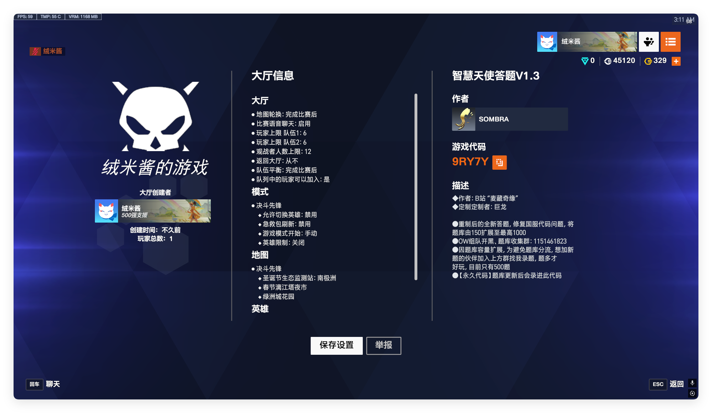
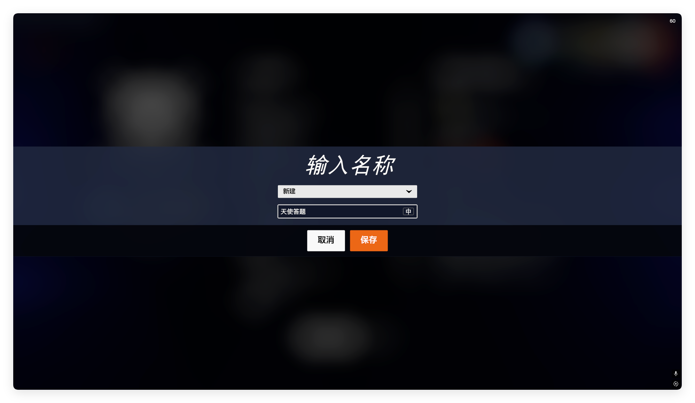
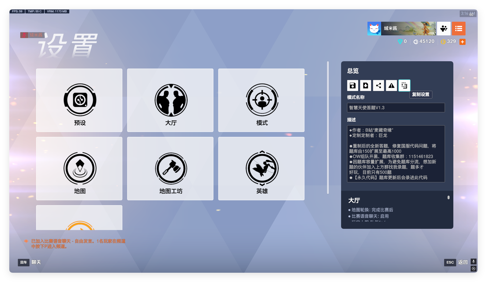
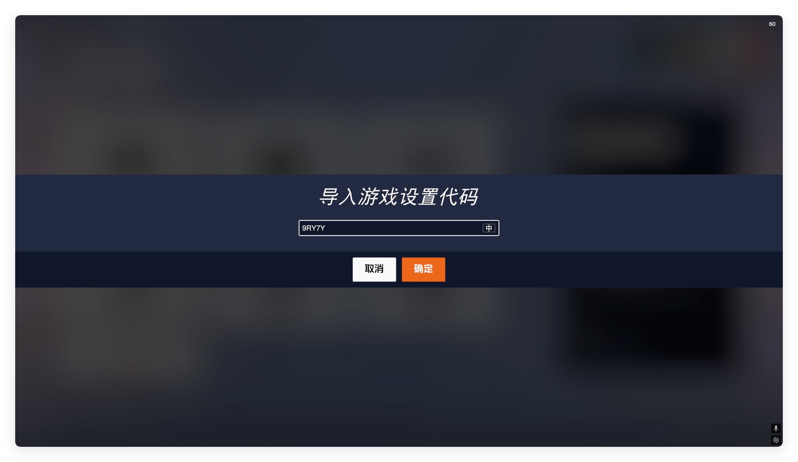
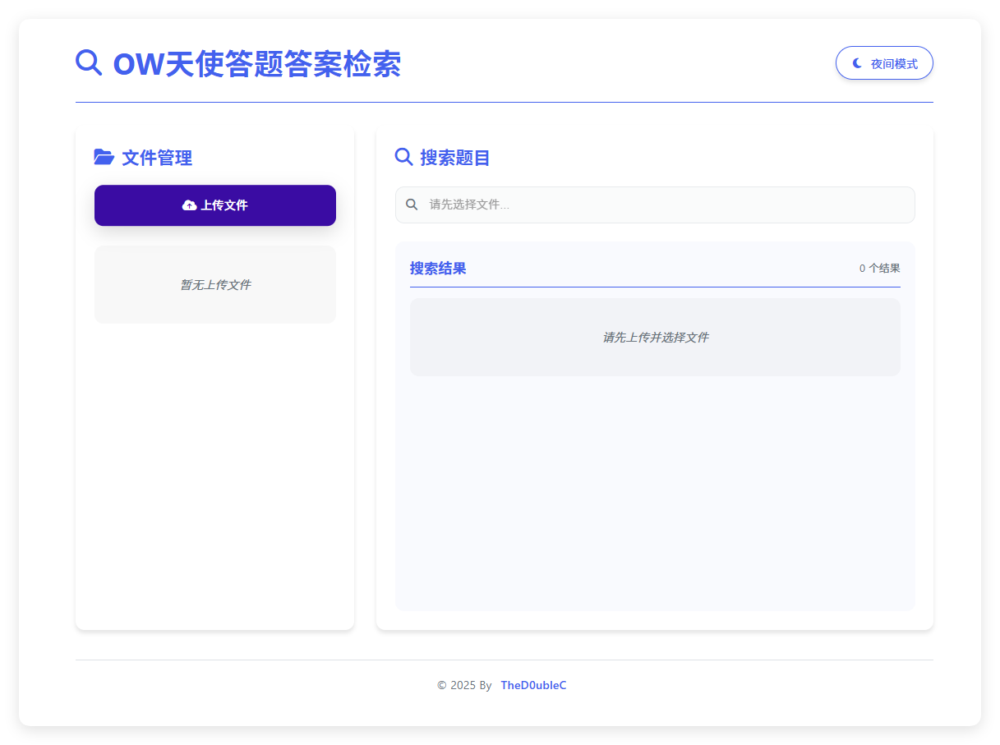
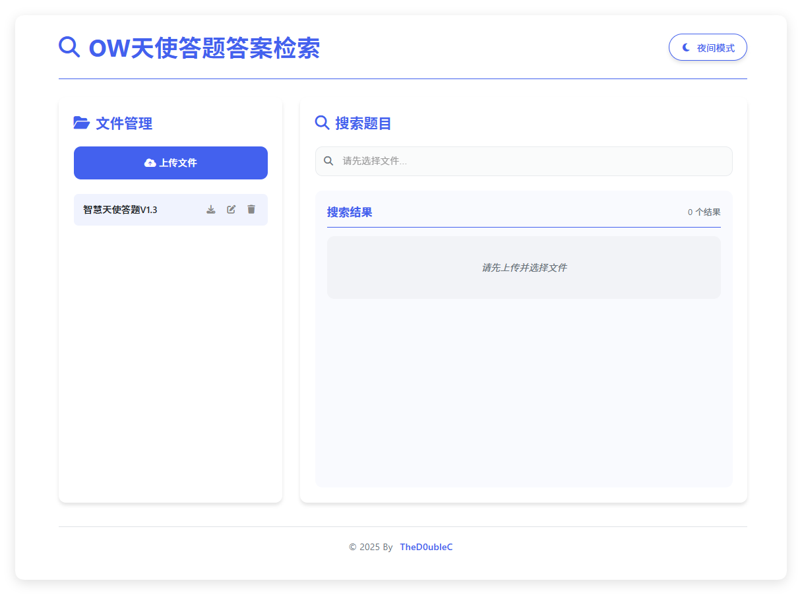
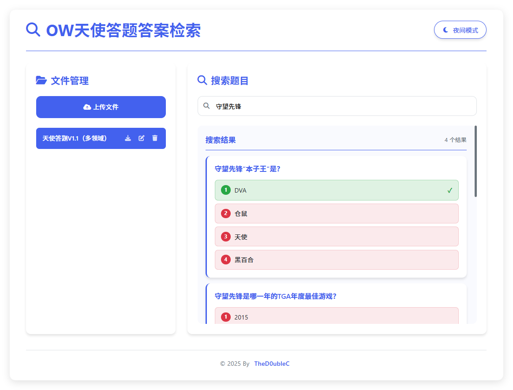

# OW 天使答题答案检索工具

## 前言

- #### _请理性使用本工具，过度使用将会失去乐趣_
- #### _仅供娱乐使用，不提倡作弊_

# 使用

### 1.导出代码

### 注意，本工具只支持 V1.1 版本，代码`9QW5K`

### 请忽略截图显示的代码并使用选项 2 进行导出

[选项 1（适用于他人开房）](#选项-1适用于他人开房)

[选项 2（适用于获取最新代码）](#选项-2适用于获取最新代码)

- 为确保题库代码为最新，请选择以下操作：
  - #### 选项 1（适用于他人开房）
    - 进入天使答题房间
    - 打开大厅
      
    - 点击左侧进入信息页
      
    - 点击保存设置
      
    - 保存后退出比赛，创建一个自定义
    - 加载刚才保存的自定义
    - 点击复制设置
      
    - 粘贴进记事本后保存到一个记得住的位置即可
  - #### 选项 2（适用于获取最新代码）
    - 这是天使答题的熔火工坊[页面](https://www.owmod.net/work/view/2503)
    - 代码 `9QW5K`
    - 创建自定义并使用代码导入
      
    - 点击复制设置
      
    - 粘贴进记事本后保存到一个记得住的位置即可

### 2.打开 [Github 托管页](https://thed0ublec.github.io/OWMercyQuiz/)

- 点击上传文件
  
- 上传完成后会自动读取信息并且保存，如不清除会话则会一直保留
- 在刷新页面后需重新选择配置
  
- 最后，尝试使用
  
